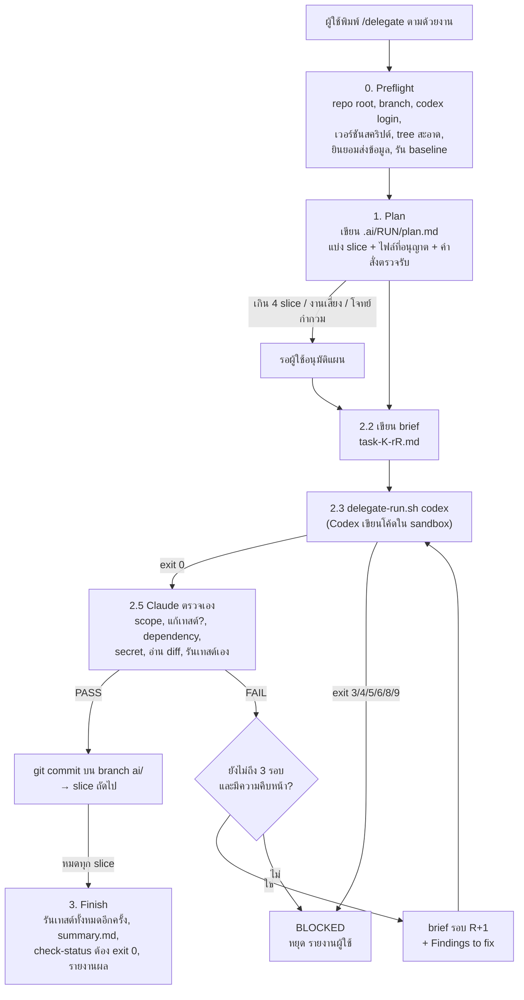

# delegate-setup: คำสั่ง `/delegate` ให้ Claude วางแผนและตรวจรับ ส่วน Codex เขียนโค้ด

ชุดไฟล์ (kit) ที่เพิ่มคำสั่ง `/delegate` ให้ Claude Code บนเครื่อง Mac โดยแบ่งงานเขียนโปรแกรมเป็นสองบทบาท

- **Claude (ผู้วางแผนและผู้ตรวจรับ)** อ่านโจทย์ แบ่งงานเป็นชุดย่อย เขียน brief ตรวจ diff เอง รันเทสต์เอง แล้วจึงตัดสิน PASS/FAIL
- **Codex CLI (ผู้เขียนโค้ด)** เขียนโค้ดและเทสต์ตาม brief ภายใน sandbox ที่เขียนได้เฉพาะโฟลเดอร์งาน

ทุกขั้นตอนถูกบันทึกเป็นไฟล์ใน `.ai/<RUN>/` ของ repo จึงตรวจย้อนหลังได้และทำต่อจากจุดที่ค้างได้ (`/delegate resume`)

> **รุ่นที่ใช้งาน: [`delegate-kit-v4.4/`](delegate-kit-v4.4/)** โฟลเดอร์รุ่นอื่นเก็บไว้เป็นประวัติเท่านั้น

## สารบัญ

1. [โครงสร้างโฟลเดอร์](#1-โครงสร้างโฟลเดอร์)
2. [หลักการออกแบบ](#2-หลักการออกแบบ)
3. [วิธีการทำงาน](#3-วิธีการทำงาน)
4. [ติดตั้ง](#4-ติดตั้ง)
5. [เตรียม repo ที่จะใช้](#5-เตรียม-repo-ที่จะใช้)
6. [การใช้งาน](#6-การใช้งาน)
7. [ปรับค่า (Configuration)](#7-ปรับค่า-configuration)
8. [ไฟล์ที่เกิดขึ้นใน `.ai/`](#8-ไฟล์ที่เกิดขึ้นใน-ai)
9. [`delegate-run.sh` และ exit code](#9-delegate-runsh-และ-exit-code)
10. [แก้ปัญหาที่พบบ่อย](#10-แก้ปัญหาที่พบบ่อย)
11. [สถานะการทดสอบและข้อจำกัด](#11-สถานะการทดสอบและข้อจำกัด)
12. [ประวัติรุ่น](#12-ประวัติรุ่น)

---

## 1. โครงสร้างโฟลเดอร์

```
delegate-setup/
├── delegate-kit-v4.4/            ← รุ่นปัจจุบัน ใช้โฟลเดอร์นี้
│   ├── delegate/
│   │   ├── SKILL.md              คำสั่ง /delegate (ขั้นตอนทั้งหมดที่ Claude ทำตาม)
│   │   └── delegate-run.sh       สคริปต์ผู้ช่วย: เรียก Codex, ledger, เพดาน, lock, timeout, ตรวจ status.md
│   ├── tests/run_tests.sh        ชุดทดสอบ 61 ข้อของ delegate-run.sh ด้วย Codex ปลอม (ไม่ใช้เครือข่าย)
│   ├── repo-templates/
│   │   ├── AGENTS.md             แม่แบบกติกาของ repo ที่ทั้ง Codex และ Claude อ่าน
│   │   └── CLAUDE.md.snippet     บรรทัดที่ต้องเพิ่มใน CLAUDE.md ของ repo (ถ้ามี)
│   ├── settings.snippet.json     permission (allow/deny) และ env สำหรับ ~/.claude/settings.json
│   ├── merge-settings.js         รวม snippet เข้า settings.json อย่างปลอดภัย (สำรองไฟล์, ไม่ลบรายการเดิม)
│   ├── install.sh                ติดตั้ง skill ไปที่ ~/.claude/skills/delegate/
│   ├── VERSION
│   └── HANDOFF.md                บันทึกการตัดสินใจออกแบบ ผลทดสอบ และสิ่งที่ยังค้าง (สำหรับผู้ดูแล)
├── delegate-kit-v3 … v4.2/       รุ่นเก่า (ประวัติ)
├── delegate-test/                repo ตัวอย่างที่ใช้ทดสอบ (calc.py, stats.py) พร้อมบันทึก .ai/ จริง
└── delegate-trap/                repo ตัวอย่างที่โจทย์ขัดแย้งกันเอง ใช้ทดสอบว่า Claude หยุดถามก่อนเรียก Codex
```

repo ทดสอบอีกตัวอยู่ข้างนอกโฟลเดอร์นี้: `../delegate-test-resume/` (mathx.py) ใช้ทดสอบการทำต่อหลังถูกขัดจังหวะและหลัง timeout

## 2. หลักการออกแบบ

| หลักการ | ทำอย่างไร |
|---|---|
| **แยกคนเขียนกับคนตรวจ** | Codex เป็นผู้เขียนโค้ดและเทสต์เพียงผู้เดียว Claude เขียนได้เฉพาะไฟล์ใน `.ai/` (ยกเว้น mechanical fix เล็ก ๆ ดูหัวข้อ 7) |
| **ไม่เชื่อรายงานของ Codex** | PASS ต้องมาจากการที่ Claude อ่าน diff เองและรันคำสั่งตรวจรับเอง ไฟล์ result ของ Codex เป็นแค่ "คำอ้าง" ที่ต้องตรวจ |
| **งานทะเบียนให้โค้ดทำ ไม่พึ่งความจำของโมเดล** | จำนวนครั้งที่เรียก Codex, เพดาน, lock และ timeout อยู่ใน `delegate-run.sh` และมี `check-status` ตรวจว่า `status.md` ตรงกับของจริงก่อนรายงานผล (เพิ่มใน v4 หลังพบว่า status.md ค้างค่าเก่าใน v3) |
| **ทุกรอบเป็นการเรียกใหม่** | ทุกรอบรัน `codex exec` ใหม่ด้วย brief ไฟล์ใหม่ ไม่ใช้ `codex exec resume` (ซึ่งไม่มี `--sandbox`) จึงไม่มีสถานะซ่อนและตรวจย้อนหลังได้ทุกรอบ |
| **จำกัดขอบเขตของ Codex** | `--sandbox workspace-write` + `approval_policy="never"` เสมอ หลังรันตรวจ banner ใน log ซ้ำ ถ้าไม่ใช่ค่านี้จะไม่รับผลงาน (exit 9) |
| **ไม่ทำสิ่งที่ย้อนคืนไม่ได้** | ไม่ push, merge, rebase, deploy, ไม่ใช้คำสั่ง git ที่ทำลายข้อมูล commit ได้เฉพาะบน branch งานหลังผ่าน PASS |
| **ขอความยินยอมก่อนส่งโค้ดออก** | Codex ส่งเนื้อหาไฟล์ไป OpenAI จึงถามยืนยันครั้งเดียวต่อ repo แล้วจดไว้ที่ `.ai/external-ok` |
| **งานเล็ก ตรวจได้** | แบ่งเป็นชุดงาน (slice) ละไม่เกินประมาณ 8 ไฟล์ / 300 บรรทัด แต่ละชุดมีรายการไฟล์ที่อนุญาตและคำสั่งตรวจรับชัดเจน |
| **มีเพดานเสมอ** | 3 รอบต่อชุดงาน, 12 ครั้งต่อการรัน /delegate หนึ่งครั้ง, หยุดเมื่อไม่มีความคืบหน้า, เพดานเวลา 540 วินาทีต่อครั้ง |

## 3. วิธีการทำงาน



### ขั้นตอนโดยละเอียด

**0. Preflight** (ข้อใดไม่ผ่าน หยุดและอธิบายเป็นภาษาไทย)

1. ต้องเปิด `claude` ที่ root ของ git repo และไม่อยู่ในสถานะ detached HEAD
2. `codex login status` ต้องมีข้อความ `Logged in` (คำสั่งนี้คืน exit 0 แม้ยังไม่ล็อกอิน จึงอ่านจากข้อความ)
3. `codex exec --help` ต้องมี flag ที่ใช้ และ `delegate-run.sh version` ต้องตรงกับรุ่นของ SKILL.md
4. สร้าง `.ai/.gitignore` ที่มีบรรทัด `*` ทำให้ `.ai/` ไม่โผล่ใน `git status` และไม่ถูก commit (ไม่ต้องแตะ `.git`)
5. `git status --porcelain` ต้องว่าง
6. ถามความยินยอมส่งโค้ดให้ OpenAI ครั้งแรกของ repo นั้น
7. หาไฟล์ที่ดูเป็นความลับ (`.env*`, `*.pem`, `*.key`, ...) ใส่ในรายการห้ามอ่านของทุก brief
8. อ่าน `AGENTS.md`, `CLAUDE.md`, README, `package.json`, `pyproject.toml`, `Makefile` เพื่อหาคำสั่งเทสต์/lint แล้วรันหนึ่งครั้งเป็น baseline ถ้าการรันทิ้งไฟล์ untracked ไว้ (เช่น `__pycache__/`) จะหยุดให้ผู้ใช้เพิ่ม `.gitignore` เอง
9. สร้างโฟลเดอร์ `.ai/<YYYYMMDD-HHMM>/` และ branch `ai/delegate-<RUN>` (ถ้าอยู่บน branch `ai/...` อยู่แล้วจะทำต่อบน branch นั้น)

**1. Plan** เขียน `plan.md`: เป้าหมาย ข้อสมมติ ชุดงาน (ไฟล์ที่อนุญาต ไฟล์ที่ห้าม คำสั่งตรวจรับ สิ่งที่อยู่นอกขอบเขต) และความเสี่ยง จะ**หยุดรออนุมัติ**ถ้ามีเกิน 4 ชุดงาน, แตะ auth/security/payment/migration/production config/CI/deploy, โจทย์กำกวมหรือขัดแย้ง หรือกำหนดคำสั่งตรวจรับไม่ได้

**2. Slice loop** สำหรับแต่ละชุดงาน

- เขียน brief ที่อ่านจบในตัว (Codex ไม่เห็นแชต) ตามแม่แบบท้าย SKILL.md
- เรียก `delegate-run.sh codex` ซึ่งรัน
  `codex exec --cd . --sandbox workspace-write --config 'approval_policy="never"' [--model ..] [--config model_reasoning_effort=..] --output-last-message result-K-rR.md -`
  โดยส่ง brief ทาง stdin
- Claude ตรวจเอง 8 ข้อ: `git add -N .` แล้วดู diff, ไฟล์อยู่ในขอบเขตไหม, มีการแก้/ลดทอนเทสต์ไหม, แก้ dependency/config ไหม, มี secret หรือของค้างไหม, อ่าน diff เทียบ brief, รันคำสั่งตรวจรับเอง, เทียบกับคำอ้างใน result
- เขียน `review-K-rR.md` บรรทัดแรกต้องเป็น `verdict: PASS|FAIL|BLOCKED`
- PASS → `git commit` / FAIL → brief รอบถัดไปพร้อม "Findings to fix" / BLOCKED → หยุดทั้งงาน

**3. Finish** รันชุดตรวจรับทั้งหมดอีกครั้งบน HEAD สุดท้าย, เขียน `summary.md`, `check-status` ต้อง exit 0 แล้วรายงาน: branch และ commit, ไฟล์ที่เปลี่ยน, ผลเทสต์จริง, จำนวนรอบและจำนวนการเรียก Codex, สิ่งที่ยังไม่ได้ยืนยัน และยืนยันว่าไม่ได้ push

## 4. ติดตั้ง

### สิ่งที่ต้องมี

- **Claude Code บน Mac** (skill ระดับผู้ใช้ใช้ไม่ได้ใน Cowork หรือ cloud session เพราะไม่มี Codex)
- **Codex CLI** ติดตั้งและล็อกอินแล้ว (`codex login`, ตรวจด้วย `codex login status`) ทดสอบกับ codex-cli 0.160.1
- **git**, **bash** (bash 3.2 ของ macOS ใช้ได้), **Node.js** (สำหรับ `merge-settings.js`)

### ขั้นตอน

1) ติดตั้ง skill ไปที่ `~/.claude/skills/delegate/`

```bash
cd delegate-kit-v4.4
```

```bash
bash install.sh
```

ถ้าเคยติดตั้งรุ่นเก่าไว้ สคริปต์จะปฏิเสธและไม่เปลี่ยนอะไรเลย (exit 2) ให้ใช้ `--force` ซึ่งจะสำรองไฟล์เดิมเป็น `*.bak-<เวลา>`

```bash
bash install.sh --force
```

2) รวม permission เข้า `~/.claude/settings.json` **รันจาก terminal ของคุณเอง** (Claude Code จะปฏิเสธการแก้ settings ของตัวเอง)

```bash
node merge-settings.js --dry-run
```

```bash
node merge-settings.js
```

สคริปต์สำรองไฟล์เดิมก่อน ไม่ลบหรือทับรายการเดิม รันซ้ำได้ ถ้า JSON เดิมเสียจะไม่แตะอะไร
สิ่งที่เพิ่ม: allow คำสั่ง git/codex ที่ skill ใช้และ `delegate-run.sh`, deny `git push`, `--yolo`, `danger-full-access`, การแก้ `runs.log` และ env `BASH_MAX_TIMEOUT_MS=1800000`

3) ทดสอบสคริปต์ผู้ช่วย (Codex ปลอม ใช้เวลาประมาณ 40 วินาที) ต้องได้ `RESULT: 61 passed, 0 failed`

```bash
bash tests/run_tests.sh
```

4) ตรวจว่าติดตั้งรุ่นถูกต้อง ต้องพิมพ์ `delegate-run 4.4`

```bash
bash ~/.claude/skills/delegate/delegate-run.sh version
```

> ถ้าต้องการล็อกไม่ให้ Claude เรียก skill นี้เองเด็ดขาด ให้เพิ่มบรรทัด `disable-model-invocation: true` ใน frontmatter ของสำเนาที่ `~/.claude/skills/delegate/SKILL.md` (ห้ามใส่ในไฟล์ของ kit เพราะตัวตรวจ skill ตอนอัปโหลดจะปฏิเสธ) และจำไว้ว่า `install.sh --force` จะเขียนทับ

## 5. เตรียม repo ที่จะใช้

1. **AGENTS.md** คัดลอก `repo-templates/AGENTS.md` ไปไว้ที่ root ของ repo แล้วเติมคำสั่งติดตั้ง/เทสต์/lint, ข้อตกลงของโค้ด และไฟล์ที่ห้ามแตะ ทั้ง Codex และ Claude อ่านไฟล์นี้ (Codex อ่านคำสั่งของโปรเจกต์ได้สูงสุด 32 KiB)
2. **CLAUDE.md** ถ้า repo มี `CLAUDE.md` อยู่แล้ว ให้เพิ่มเนื้อหาจาก `repo-templates/CLAUDE.md.snippet` (บรรทัด `@AGENTS.md` จำเป็น เพราะ Claude Code อ่าน AGENTS.md เองเฉพาะเมื่อไม่มี CLAUDE.md)
3. **.gitignore** เพิ่มไฟล์ที่เกิดจากการรันเทสต์ (`__pycache__/`, `.pytest_cache/`, `node_modules/`, `.DS_Store`) แล้ว commit มิฉะนั้น preflight จะหยุด
4. **Permission ของคำสั่งเทสต์** เพิ่มคำสั่งเทสต์/lint ของ repo ใน `.claude/settings.local.json` ของ repo นั้น (หรือใช้โหมด acceptEdits) มิฉะนั้นวงจรจะหยุดรอให้อนุมัติทุกครั้งที่รันเทสต์ ตัวอย่าง

   ```json
   { "permissions": { "allow": ["Bash(python3 -m unittest *)", "Bash(npm test *)"] } }
   ```

5. **working tree ต้องสะอาด** commit หรือ stash งานค้างก่อน

## 6. การใช้งาน

### เริ่มงานใหม่

```bash
cd /path/to/repo
```

```bash
claude
```

แล้วพิมพ์ใน Claude Code

```
/delegate เพิ่มฟังก์ชัน div(a, b) ใน mathx.py โดย div(x, 0) ต้อง raise ValueError พร้อมเทสต์ คำสั่งตรวจรับ: python3 -m unittest -v
```

เคล็ดลับการเขียนโจทย์

- บอก **ผลที่สังเกตได้** และ **คำสั่งตรวจรับ** ถ้าทำได้ (ถ้าไม่บอก Claude จะหาเองจาก AGENTS.md/README และถามถ้าหาไม่ได้)
- บอกไฟล์ที่เกี่ยวข้องหรือไฟล์ที่ห้ามแตะ ถ้ามี
- ใช้ข้อมูลตัวอย่าง ไม่ใช้ข้อมูลจริงหรือข้อมูลขององค์กร

สิ่งที่จะเห็นระหว่างทาง: คำถามยืนยันส่งข้อมูล (ครั้งแรกของ repo), branch `ai/delegate-<RUN>`, บรรทัด `runs_total=N/12` และ `settings confirmed approval=never sandbox=workspace-write` หลัง Codex แต่ละครั้ง และรายงานสรุปเป็นภาษาไทยตอนจบ

### ทำต่อจากที่ค้าง

```
/delegate resume
/delegate resume 20261008-1126
```

Claude จะหาโฟลเดอร์รันล่าสุดที่ยังไม่ DONE เทียบ `status.md` กับ git และ `runs.log` (ledger ชนะ status.md เสมอ) แล้ว

- **หยุดถาม** ถ้า git ไม่ตรงกับที่บันทึกไว้, มี START ที่ไม่มี END (Codex อาจยังรันอยู่), END ล่าสุดเป็น `rc=timeout` หรือ rc ไม่เป็นศูนย์, หรือ state เป็น BLOCKED (รันซ้ำด้วย brief เดิมไม่ช่วย ต้องเปลี่ยนอะไรสักอย่างก่อน เช่น ลดขนาดงาน เพิ่ม timeout)
- **รันรอบเดิมซ้ำ** ถ้า END ล่าสุดเป็น `rc=interrupted`, tree สะอาด และยังไม่มีไฟล์ result (ครั้งที่ถูกขัดจังหวะนับรวมในเพดานด้วย)
- กรณีอื่น ทำต่อจาก `next_step` ที่บันทึกไว้

### หลังงานเสร็จ

ดูผลด้วย `INITIAL_BASE` (อยู่ใน `.ai/<RUN>/status.md` บรรทัด `initial_base:`) ไม่ใช่ชื่อ branch เพราะรันอาจต่อยอดบน branch `ai/` เดิม

```bash
git log --oneline <INITIAL_BASE>..HEAD
```

```bash
git diff <INITIAL_BASE>..HEAD
```

`/delegate` ไม่ push และไม่ merge ให้ ผู้ใช้ merge เอง ถ้าต้องการยกเลิก

- `task_branch` ต่างจาก `original_branch`: สลับกลับไป branch เดิมแล้วลบ task branch
- `task_branch` เท่ากับ `original_branch` (รันต่อยอดบน branch `ai/` เดิม): **ห้ามลบ branch** เพราะมีงานของรันก่อนหน้า ต้อง `git reset --hard <INITIAL_BASE>` ซึ่งทิ้งงานของรันนี้ทั้งหมด ผู้ใช้ต้องตัดสินใจเอง

## 7. ปรับค่า (Configuration)

แก้บล็อก Configuration ต้นไฟล์ `delegate/SKILL.md` ใน kit แล้ว `bash install.sh --force` (อย่าแก้สำเนาที่ติดตั้งแล้วโดยตรง เพราะจะไม่ตรงกับ kit)

| ค่า | ค่าเริ่มต้น | ความหมาย |
|---|---|---|
| `CODEX_MODEL` | ว่าง | ว่าง = ใช้ default ของ Codex (บนเครื่องทดสอบคือ `gpt-6.1-sol`) ตั้งได้เฉพาะชื่อที่บัญชีใช้ได้ |
| `CODEX_EFFORT` | `high` | ส่งเป็น `model_reasoning_effort` |
| `CODEX_TIMEOUT_SEC` | `540` | สคริปต์หยุด Codex เมื่อเกินเวลานี้ Bash timeout ของ Claude = (ค่านี้ + 60) × 1000 ms ต้องไม่เกิน `BASH_MAX_TIMEOUT_MS` (ค่าเริ่มต้นของ Claude Code 600000 ms, snippet ตั้งเป็น 1800000 ms จึงเพิ่มได้ถึง 1740 วินาทีหลัง merge settings) |
| `MAX_ROUNDS_PER_SLICE` | `3` | จำนวนรอบสูงสุดต่อชุดงานก่อน BLOCKED |
| `MAX_CODEX_RUNS_PER_RUN` | `12` | เพดานการเรียก Codex ต่อหนึ่งรัน (สคริปต์บังคับ) |
| `MAX_SLICES_WITHOUT_CONFIRM` | `4` | เกินจำนวนนี้ต้องรออนุมัติแผน |
| `CLAUDE_MECHANICAL_FIXES` | `allow` | `allow`: Claude แก้เองได้ถ้ารวมไม่เกิน 5 บรรทัด ไม่เปลี่ยนพฤติกรรม (typo, import order, whitespace, formatter ของ repo) และต้องบันทึกใน review ว่า `claude-mechanical-fix` / `deny`: ไม่แก้ไฟล์ source เลย |

## 8. ไฟล์ที่เกิดขึ้นใน `.ai/`

```
.ai/
├── .gitignore              บรรทัดเดียว "*" (ซ่อนทั้งโฟลเดอร์จาก git)
├── external-ok             วันที่ที่ผู้ใช้ยินยอมให้ส่งโค้ดให้ OpenAI
└── <RUN>/                  เช่น 20261008-1126
    ├── status.md           สถานะปัจจุบัน (ตรวจด้วย check-status)
    ├── plan.md             แผนและชุดงาน
    ├── task-K-rR.md        brief ที่ส่งให้ Codex
    ├── result-K-rR.md      ข้อความสุดท้ายของ Codex (คำอ้าง ไม่ใช่ผลตรวจ)
    ├── codex-K-rR.log      stderr ของ Codex (มี banner approval/sandbox)
    ├── stdout-K-rR.txt     stdout ของ Codex
    ├── review-K-rR.md      ผลตรวจของ Claude บรรทัดแรก verdict: ...
    ├── runs.log            ledger START/END ที่สคริปต์เขียนเท่านั้น
    └── summary.md          สรุปตอนจบ
```

ตัวอย่าง `runs.log` จริง (repo `delegate-test-resume`) รอบแรกหมดเวลาเพราะตั้ง timeout 8 วินาทีเพื่อทดสอบ แล้วทำต่อหลังเพิ่ม timeout

```
START 2026-10-08T11:27:08+0700 slice=01 round=1 model=default effort=high pid=51652
END 2026-10-08T11:27:16+0700 slice=01 round=1 rc=timeout result_bytes=0
START 2026-10-08T11:36:45+0700 slice=01 round=2 model=default effort=high pid=54590
END 2026-10-08T11:37:18+0700 slice=01 round=2 rc=0 result_bytes=469
```

ตัวอย่าง `status.md`

```
run: 20261008-1126
state: DONE
original_branch: ai/delegate-20261008-1120
task_branch: ai/delegate-20261008-1120
initial_base: af638651ce421393fae7a4ddbcdbb8d0a995aba1
slice: 01/1
round: 2
codex_runs: 2
slice_base: af638651ce421393fae7a4ddbcdbb8d0a995aba1
baseline: python3 -m unittest -v -> exit 0, 3 tests OK
last_verdict: PASS
next_step: none, run complete
config: model=default effort=high timeout_sec=540 max_rounds=3 mechanical_fixes=allow
task: เพิ่มฟังก์ชัน div(a, b) ใน mathx.py ...
```

## 9. `delegate-run.sh` และ exit code

```
bash ~/.claude/skills/delegate/delegate-run.sh version
bash ~/.claude/skills/delegate/delegate-run.sh codex <RUN> <K> <R> [--model M] [--effort E] [--max-runs N] [--timeout-sec S]
bash ~/.claude/skills/delegate/delegate-run.sh count <RUN>
bash ~/.claude/skills/delegate/delegate-run.sh check-status <RUN>
```

ต้องรันจาก root ของ repo

| exit | ความหมาย | สิ่งที่ skill ทำ |
|---|---|---|
| 0 | สำเร็จ Codex เขียน result แล้ว | ไปขั้นตรวจ |
| 2 | argument ผิด, ไม่มี brief, result ของรอบนี้มีอยู่แล้ว, ไม่ได้อยู่ที่ root (ไม่ได้รันและไม่นับ) | แก้สาเหตุ ถ้า result มีอยู่แล้วให้หยุดถาม ไม่ลบเอง |
| 3 | ถึงเพดานจำนวนครั้ง (ไม่เรียก Codex) | BLOCKED ถามผู้ใช้ว่าจะเพิ่มเพดานไหม |
| 4 | มีรันอื่นถือ lock อยู่ | BLOCKED ไม่ retry ไม่ kill |
| 5 | Codex exit ไม่เป็นศูนย์ | BLOCKED |
| 6 | Codex exit 0 แต่ไม่มี result | BLOCKED |
| 7 | (`check-status`) status.md ไม่ตรงกับ ledger/review/summary | แก้ status.md แล้วตรวจใหม่ ห้ามรายงานผลจนกว่าจะ exit 0 |
| 8 | Codex ถูกหยุดเพราะเกินเวลา (TERM แล้ว KILL หลัง 5 วินาที) | BLOCKED tree อาจแก้ไปครึ่งทาง |
| 9 | banner ของ Codex ไม่ใช่ `approval=never` / `sandbox=workspace-write` | BLOCKED ไม่รับผลงาน ให้ผู้ใช้ตรวจ `~/.codex/config.toml` |

เมื่อถูก TERM/INT (เช่น กด Esc ใน Claude Code) สคริปต์จะหยุด Codex และ process ลูกทั้งต้นไม้ บันทึก `rc=interrupted` และปล่อย lock

`check-status` ตรวจว่า `codex_runs` เท่ากับจำนวน START ใน ledger, `last_verdict` ตรงกับบรรทัดแรกของ review ล่าสุด และถ้า `state: DONE` ต้องมี review ล่าสุดเป็น PASS, มี `summary.md` และ `next_step` ขึ้นต้นด้วย `none`

## 10. แก้ปัญหาที่พบบ่อย

| อาการ | สาเหตุและวิธีแก้ |
|---|---|
| หยุดที่ preflight ว่าไม่ได้อยู่ที่ root | เปิด `claude` ที่ root ของ repo |
| หยุดเพราะ `Not logged in` | รัน `codex login` เอง |
| `delegate-run.sh version` ไม่ตรงรุ่น | `bash install.sh --force` จากโฟลเดอร์ kit รุ่นล่าสุด |
| หยุดหลัง baseline เพราะมีไฟล์ untracked | เพิ่มไฟล์นั้นใน `.gitignore` แล้ว commit |
| ถามสิทธิ์ทุกครั้งที่รันเทสต์ | เพิ่มคำสั่งเทสต์ใน `.claude/settings.local.json` ของ repo |
| exit 8 (timeout) | งานใหญ่เกินไปหรือ timeout สั้นไป แบ่งงานให้เล็กลง หรือเพิ่ม `CODEX_TIMEOUT_SEC` (ดูหัวข้อ 7) แล้ว `/delegate resume` |
| exit 9 / banner แสดง `approval: on-request` | มักมาจาก `approvals_reviewer = "auto_review"` ใน `~/.codex/config.toml` ตั้งแต่ v4.1 สคริปต์ส่ง `approval_policy="never"` ทับให้แล้ว ถ้ายังเกิด ให้ตรวจ profile ใน config ของ Codex |
| Codex ค้างเงียบ ๆ ไม่ error | Codex ที่ยังไม่ล็อกอินจะค้าง timeout ของสคริปต์จะหยุดให้ (exit 8) ตรวจ `codex login status` |
| `merge-settings.js` ถูกปฏิเสธใน Claude Code | รันจาก terminal ของคุณเอง |
| มี `Bash(codex exec *)` ค้างใน settings | เป็นของ v3 สคริปต์ merge ไม่ลบรายการเดิม ลบเองได้ถ้าต้องการให้การเรียก Codex ตรง ๆ ถูกถามสิทธิ์ |
| หา process Codex ที่ค้าง | ใช้ `pgrep -fl "[e]xec --cd \. --sandbox workspace-write"` เท่านั้น อย่าใช้ `pgrep -fl "codex exec"` เพราะจะจับ `codex exec-server` ของ ChatGPT desktop app (ห้าม kill process นั้น) |

## 11. สถานะการทดสอบและข้อจำกัด

**ยืนยันแล้ว**

- `tests/run_tests.sh` 61/61 ผ่าน (Linux และ macOS bash 3.2) ครอบคลุม ledger, lock (ใช้อยู่/ค้าง), เพดาน, timeout รวมกรณีต้อง KILL, TERM ฆ่า process ลูกหลาน, check-status, banner และ pattern ของ `pgrep`
- บน Mac กับ Codex จริง: เส้นทางปกติ, โจทย์ขัดแย้ง (`delegate-trap`: Claude หยุดถามก่อนเรียก Codex), 5 ชุดงานพร้อมรออนุมัติแผน (`delegate-test` run `20261008-1003`), กด Esc ระหว่าง Codex ทำงาน (ledger บันทึก `rc=interrupted`, lock ถูกปล่อย, ไม่มี process ค้าง)
- `--config approval_policy="never"` ทับ `auto_review` ใน config ของผู้ใช้ได้จริง
- `delegate-test-resume` มีบันทึกการทำต่อหลัง `rc=interrupted` (run `20261008-1120`) และหลัง `rc=timeout` → BLOCKED → เพิ่ม timeout → PASS (run `20261008-1126`) ผลนี้ยังไม่ได้บันทึกใน HANDOFF.md

**ยังไม่ได้ทดสอบ**

- รอบ FAIL แล้วแก้ในรอบที่ 2 ด้วย "Findings to fix"
- การหยุดเมื่อไม่มีความคืบหน้า
- exit 9 กับ Codex จริง
- กฎ deny `Edit(.ai/*/runs.log)` และ allow รูปแบบ `~` กับ Claude Code จริง

**ข้อจำกัด**

- ใช้ได้เฉพาะ Claude Code บนเครื่องที่มี Codex (ไม่ใช่ Cowork หรือ cloud session)
- รายการไฟล์ห้ามอ่านเป็น**คำสั่ง**ให้ Codex ไม่ใช่สิ่งที่บังคับได้จริง sandbox ป้องกันการเขียน ไม่ได้ป้องกันการอ่านไฟล์ใน repo
- โค้ดใน repo ถูกส่งไป OpenAI อย่าใช้กับ repo ที่มีข้อมูลลับ ข้อมูลส่วนบุคคล หรือข้อมูลที่องค์กรห้ามส่งออก
- Codex โหลด plugin/skill ส่วนตัวของผู้ใช้ (เช่น `ponytail` ใน `~/.codex/plugins/`) เข้าทุกเซสชัน brief ระบุให้ brief และ AGENTS.md มีลำดับเหนือกว่า แต่ยังไม่ได้ยืนยันว่าได้ผล ปิด plugin ระหว่างใช้ /delegate ได้ถ้าต้องการ
- ใช้ token ประมาณ 10,000 ต่อการเรียก Codex หนึ่งครั้งสำหรับงานเล็ก แต่ละครั้งใช้เวลาประมาณ 15–45 วินาทีในการทดสอบ

## 12. ประวัติรุ่น

| รุ่น | วันที่ | สิ่งที่เปลี่ยน |
|---|---|---|
| v3 | 2026-10-07 | รุ่นแรกที่ใช้งานจริงบน Mac: SKILL.md + install.sh + merge-settings.js โมเดลนับจำนวนครั้งและอัปเดต status.md เอง |
| v4 | 2026-10-07 | เพิ่ม `delegate-run.sh` (ledger, เพดาน, lock, timeout, `check-status`) เพราะ v3 พบ status.md ค้างค่าเก่า และชุดทดสอบด้วย Codex ปลอม |
| v4.1 | 2026-10-07 | ส่ง `approval_policy="never"` ทุกครั้งและตรวจ banner หลังรัน (exit 9) หลังพบ `approval: on-request` จาก `auto_review` |
| v4.2 | 2026-10-08 | ใช้ `INITIAL_BASE` เป็นจุดอ้างอิงตอนดูผล และแยกวิธียกเลิกเมื่อรันต่อยอดบน branch `ai/` เดิม |
| v4.3 | 2026-10-08 | กฎ Resume: หยุดถามเมื่อ END เป็น `rc=timeout`/rc ไม่เป็นศูนย์/state BLOCKED และรันซ้ำเมื่อ `rc=interrupted` (ไม่มีโฟลเดอร์แยกในนี้) |
| v4.4 | 2026-10-08 | เปลี่ยน pattern `pgrep` ไม่ให้จับ `codex exec-server` ของ ChatGPT desktop app, เพิ่มเทสต์ T14 |

รายละเอียดเหตุผลการออกแบบ ผลทดสอบแต่ละรอบ และกติกาสำหรับผู้แก้ไข kit ต่อ อยู่ใน [`delegate-kit-v4.4/HANDOFF.md`](delegate-kit-v4.4/HANDOFF.md)

### กติกาสำหรับผู้แก้ไข kit

- ห้ามผ่อนกฎความปลอดภัย: ไม่ใช้ `--yolo`, `--dangerously-bypass-approvals-and-sandbox`, `danger-full-access`, ไม่ push/merge/deploy, ไม่ประกาศ PASS จากรายงานของ Codex อย่างเดียว
- แก้ `delegate-run.sh` แล้วต้องรัน `bash tests/run_tests.sh` ให้ผ่านทุกข้อ และปรับ `SCRIPT_VERSION` ให้ตรงกับ SKILL.md
- frontmatter ของ SKILL.md มีได้เฉพาะ `name`, `description`, `compatibility`, `metadata` และ description ห้ามมี `<` หรือ `>`
- หลีกเลี่ยง `$` ในเนื้อหา SKILL.md เพราะ Claude Code อาจแทนค่าตัวแปร
